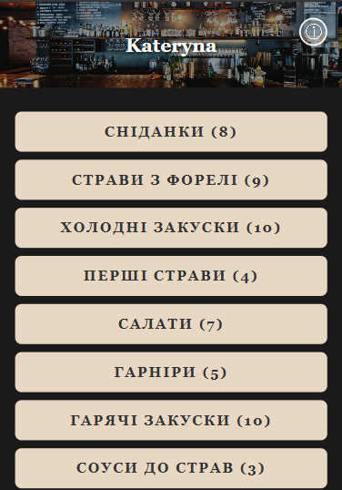

# 🍽️ Kateryna Menu App

Простий та стильний веб-додаток для демонстрації меню ресторану.

---

## 🖼️ Приклад відображення меню

## ✨ Особливості

- 🥐 **Динамічне меню** з різними секціями: сніданки, основні страви, закуски, напої.
- 🖼️ **Модальні вікна** для перегляду деталей страв та контактів.
- ➕➖ **Регулювання кількості** страв з автоматичним підрахунком ціни.
- 📱 **Адаптивний дизайн** для мобільних і десктопів.

---

## 📁 Структура проекту

/project-root
├── index.html # 🏠 Основна сторінка
├── style.css # 🎨 Стилі сайту
├── menuData.js # 📋 Дані меню (страви та напої)
├── script.js # ⚙️ Логіка рендеру, модалок та взаємодії
└── README.md # 📖 Цей файл

---

## 🚀 Як запустити

1. Скачайте або клонуте репозиторій.
2. Відкрийте `index.html` у будь-якому сучасному браузері.
3. Меню завантажиться автоматично.
4. Натискайте на секції для відкриття/закриття, на страви для деталей, кнопку `ⓘ` для контактів.

---

## 🥗 Додавання нових страв

1. Відкрийте `menuData.js`.
2. Додайте новий об’єкт у потрібну секцію.
3. Заповніть поля:
   - `nameUk` – назва страви
   - `price` – ціна
   - `weight` – вага
   - `time` – час приготування
   - `description` – опис
   - `image` – URL або Base64 зображення
4. Страва з’явиться автоматично після оновлення сторінки.
